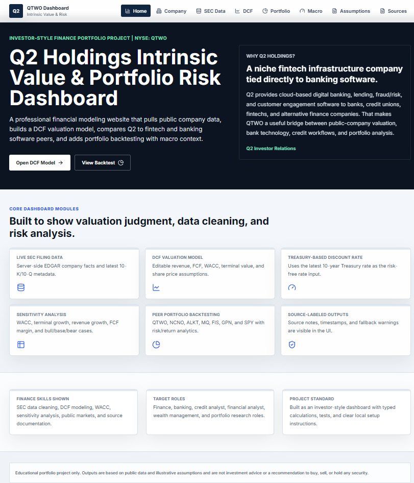
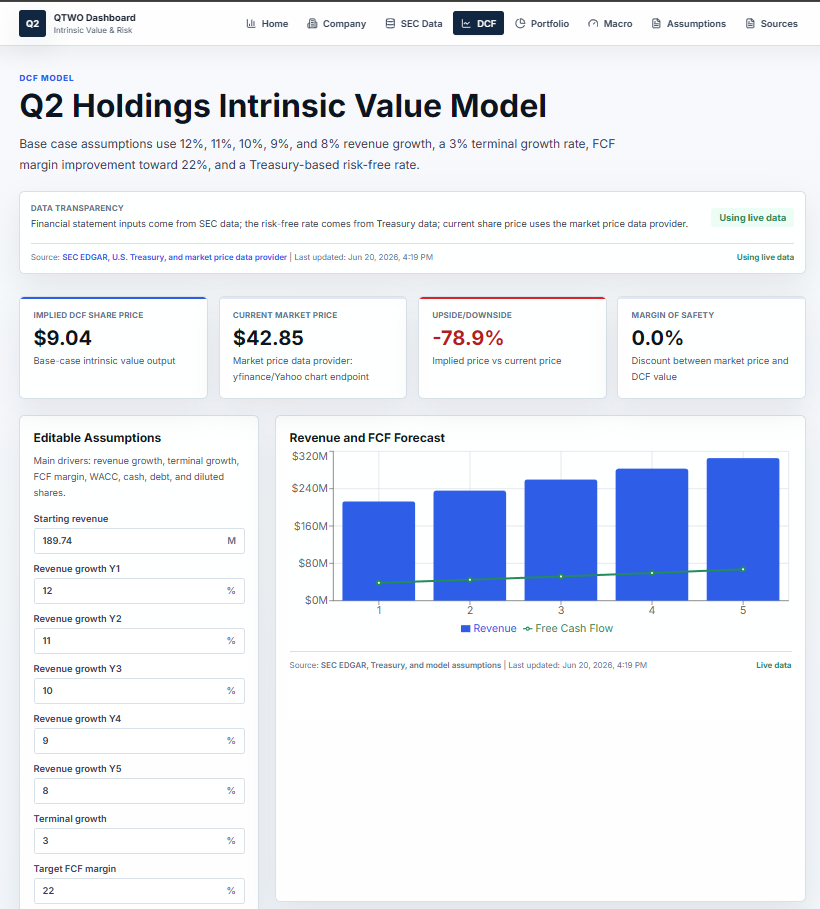
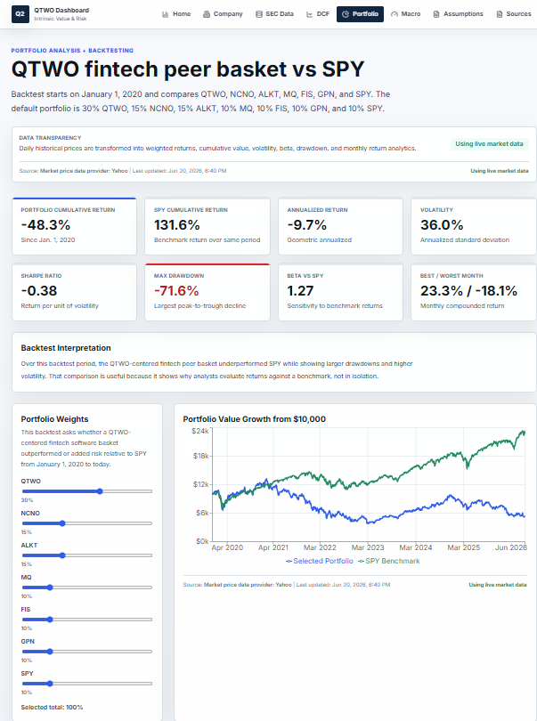
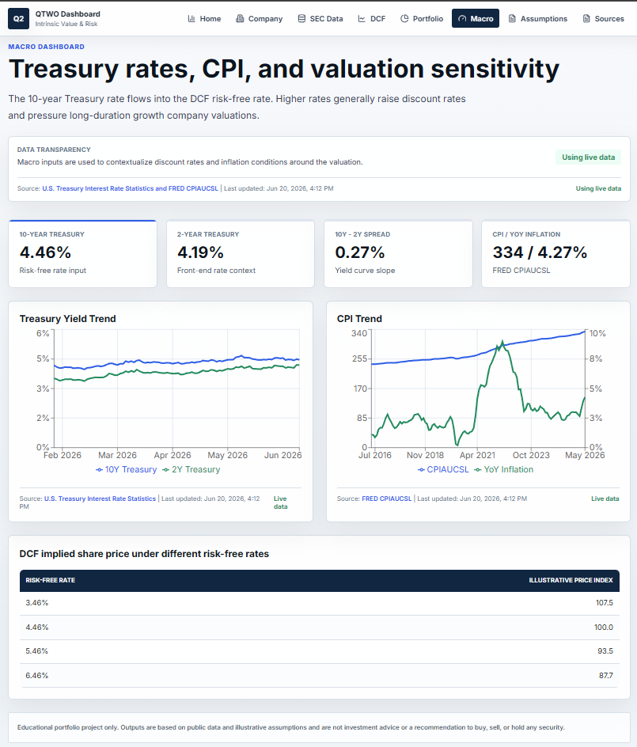

# Q2 Holdings Intrinsic Value & Portfolio Risk Dashboard

Q2 Holdings Intrinsic Value & Portfolio Risk Dashboard is a full-stack financial modeling project built to analyze a niche public fintech company using SEC filing data, Treasury yield data, FRED macroeconomic data, and historical market prices. The project combines company research, DCF valuation, sensitivity analysis, peer comparison, and portfolio backtesting into one investor-style dashboard.

This project is designed as a recruiter-ready finance portfolio piece for roles in finance, banking, credit analysis, financial analysis, wealth management, and portfolio research.

## Why Q2 Holdings Was Selected

Q2 Holdings, Inc. (NYSE: QTWO) provides cloud-based digital banking, lending, fraud/risk, and customer engagement software to banks, credit unions, fintechs, and alternative finance companies. I selected Q2 because it connects directly to banking technology, fintech infrastructure, lending workflows, risk tools, and financial institution software.

## Screenshots

Add screenshots to `public/screenshots` before publishing or sharing the project:

- `public/screenshots/home.png`
- `public/screenshots/dcf.png`
- `public/screenshots/portfolio.png`
- `public/screenshots/macro.png`

Suggested README preview syntax after screenshots are added:

```md




```

## Tech Stack

- Next.js App Router
- TypeScript
- Tailwind CSS
- Recharts
- Server-side data fetching
- SEC EDGAR Company Facts and Submissions APIs
- U.S. Treasury XML feed
- FRED CPI CSV
- Yahoo chart endpoint as the market price data provider
- Optional Python stack documented in `requirements.txt` for future FastAPI, pandas, numpy, and yfinance expansion

## Data Sources

- SEC EDGAR Company Facts: https://data.sec.gov/api/xbrl/companyfacts/CIK0001410384.json
- SEC EDGAR Submissions: https://data.sec.gov/submissions/CIK0001410384.json
- Q2 Holdings SEC filing page: https://www.sec.gov/edgar/browse/?CIK=1410384
- Q2 Holdings Investor Relations: https://investors.q2.com/
- U.S. Treasury Interest Rate Statistics: https://home.treasury.gov/resource-center/data-chart-center/interest-rates/pages/xml?data=daily_treasury_yield_curve&field_tdr_date_value=2026
- FRED CPIAUCSL: https://fred.stlouisfed.org/graph/fredgraph.csv?id=CPIAUCSL
- yfinance/Yahoo chart endpoint for historical market price data

Every live-data page shows the source, last updated timestamp, and whether the dashboard is using live data or fallback sample data.

## Features

- Server-side SEC EDGAR fetches using a project-specific User-Agent.
- XBRL financial tag normalization for revenue, net income, operating cash flow, capex, cash, liabilities, equity, shares, and stock-based compensation.
- Company overview page with latest filing metadata and SEC-derived financial facts.
- Editable DCF model with current market price, implied share price, upside/downside, WACC, margin of safety, enterprise value, and equity value.
- Sensitivity tables for WACC vs terminal growth, revenue growth vs FCF margin, and bull/base/bear valuation cases.
- Portfolio backtest for QTWO, NCNO, ALKT, MQ, FIS, GPN, and SPY.
- Portfolio analytics including cumulative return, SPY cumulative return, annualized return, annualized volatility, Sharpe ratio, max drawdown, beta vs SPY, best month, worst month, and correlation matrix.
- Macro dashboard with Treasury rates, yield spread, CPI, inflation, and valuation sensitivity to risk-free rates.
- Responsive finance-dashboard layout with source labels, data status badges, and educational disclaimers.

## How to Run Locally

```bash
npm install
npm run dev
```

Open http://localhost:3000.

Recommended validation:

```bash
npm run lint
npm run typecheck
npm test
npm run build
```

## Environment Variables

No required secrets are needed for the current version. Copy `.env.example` if deploying or extending the app:

```bash
cp .env.example .env.local
```

`NEXT_PUBLIC_APP_URL` is optional metadata. SEC, Treasury, FRED, and market price requests are performed server-side or through public endpoints without API keys.

## Vercel Deployment Notes

- The project is ready for Vercel as a standard Next.js app.
- Server-side fetches are implemented in `lib/data/*` and use Next.js revalidation settings.
- SEC requests are not made directly from the browser.
- The normal Next output mode is used, avoiding Windows or deployment symlink issues from standalone packaging.
- Add screenshots to `public/screenshots` before sharing the deployed link with recruiters.

## Model Assumptions

- Base revenue growth: 12%, 11%, 10%, 9%, and 8%.
- Terminal growth: 3%.
- Free cash flow margin improves toward 22%.
- Tax rate: 21%.
- Risk-free rate: latest 10-year Treasury rate from Treasury data.
- Equity risk premium: 5.5%.
- Beta defaults to 1.2 if unavailable.
- WACC uses cost of equity and after-tax debt cost when debt data is available.

## Limitations

This project is educational and is not investment advice. Public APIs can fail, change schemas, throttle requests, or report company-specific XBRL labels. If live data is unavailable, the app uses clearly labeled fallback sample data from `lib/fallbackData.ts`. The valuation model is simplified and should not be used as a real investment recommendation.

## Interview Explanation

"I built a financial valuation and portfolio risk dashboard around Q2 Holdings, a niche digital banking software company. I chose Q2 because it connects directly to banking, fintech infrastructure, lending, fraud/risk tools, and financial institution technology. The project pulls financial data from SEC filings, uses Treasury rates in the discount rate, adds CPI as a macro input, and builds a DCF model with sensitivity analysis. I also added a portfolio backtest to compare Q2 against fintech and financial technology peers. The goal was to show that I can combine finance, public filings, valuation, data cleaning, and investment analysis in one project."

## Resume Bullets

- Built a full-stack financial modeling dashboard for Q2 Holdings (QTWO), using SEC EDGAR filing data, Treasury rates, and FRED macroeconomic data.
- Developed a DCF valuation model with editable assumptions, WACC calculation, terminal value analysis, and sensitivity tables.
- Created a fintech peer portfolio backtest measuring cumulative return, volatility, Sharpe ratio, beta, max drawdown, and correlation versus SPY.
- Automated public financial data collection from SEC filings and transformed XBRL company facts into clean valuation inputs.
- Designed an investor-style dashboard with valuation outputs, macro indicators, peer analysis, and source-linked financial data.

## Disclaimer

This model is for educational and portfolio purposes only and is not investment advice.
